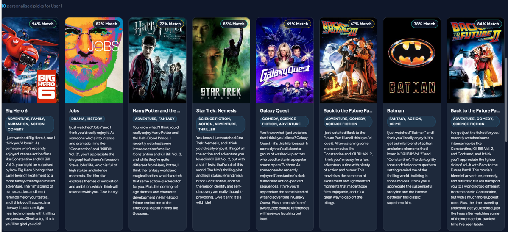
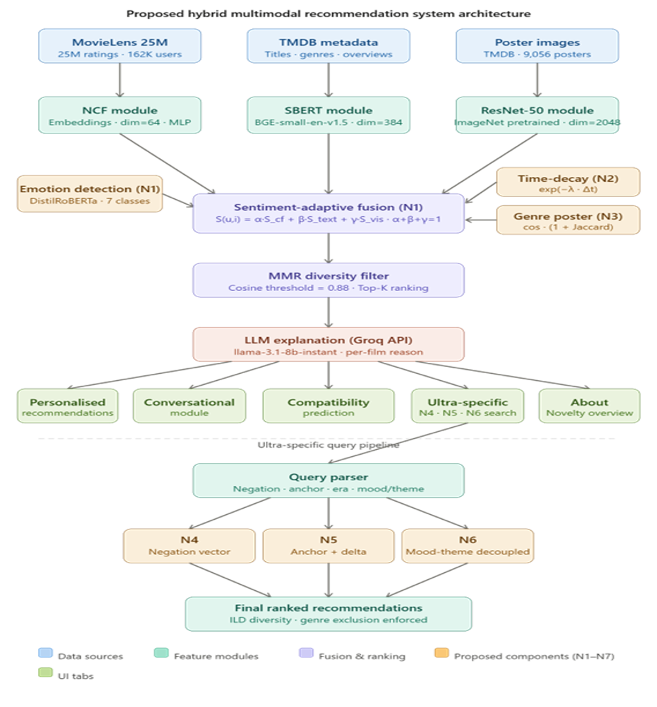
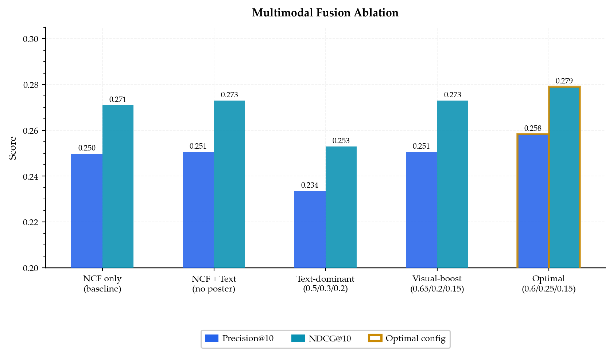
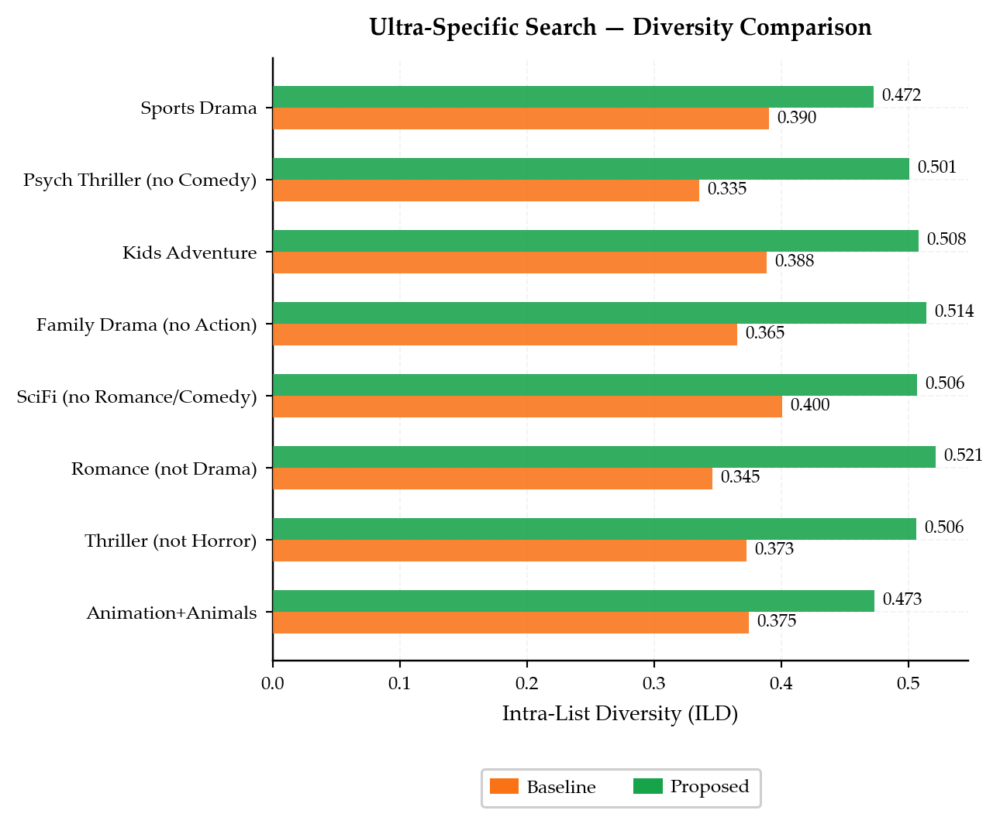
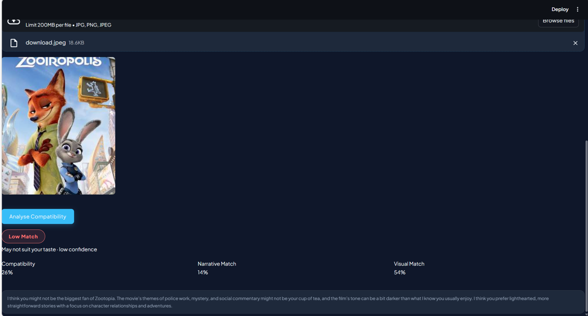
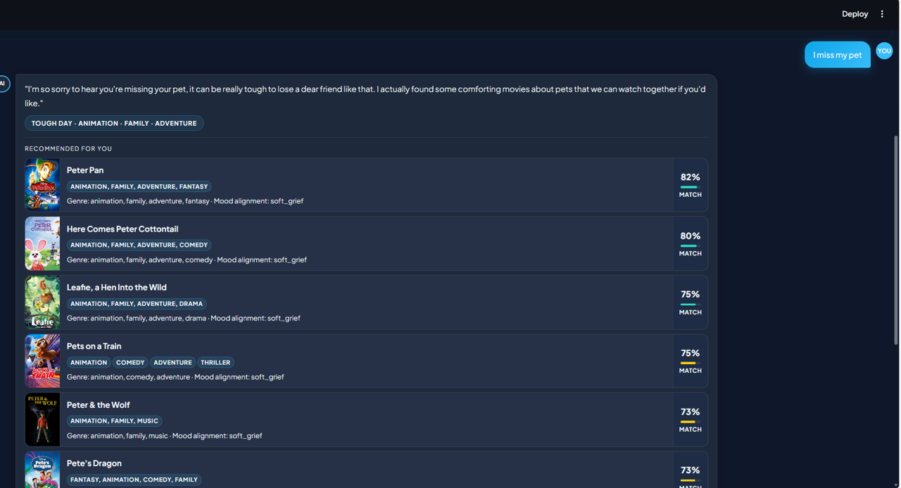
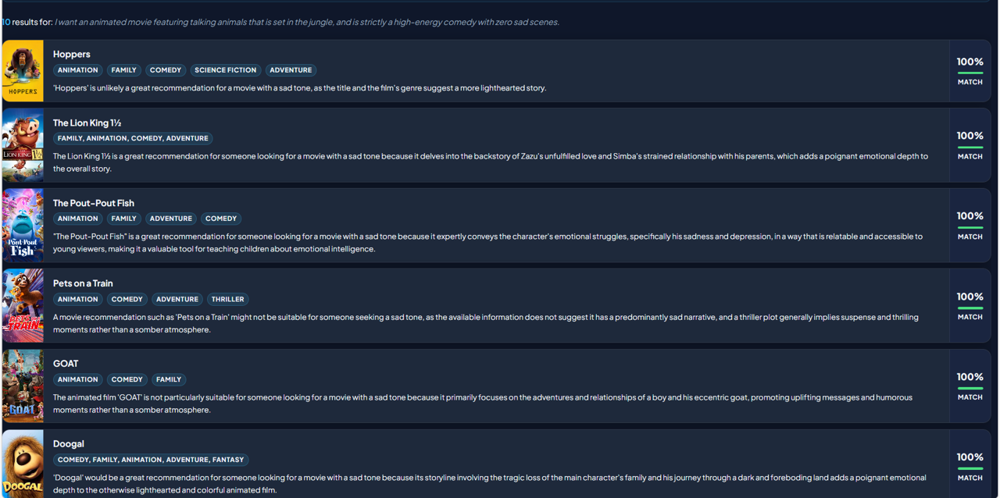

# CineMatch — Multimodal Explainable Movie Recommendation System

[](https://python.org)
[](https://tensorflow.org)
[](https://pytorch.org)
[](https://streamlit.io)
[](LICENSE)

A research-grade hybrid movie recommendation system combining Neural Collaborative Filtering, Sentence-BERT text embeddings, and ResNet-50 visual poster features. The system incorporates seven novel techniques not previously proposed in recommender systems literature (2020–2025), verified against papers from SIGIR, RecSys, ECIR, WWW, and ACM Multimedia.

---

<!-- ADD MEDIA: Hero screenshot of the Streamlit app (For You tab, poster grid visible).
     Save as docs/screenshots/app_hero.png and uncomment:
      -->

---

## Table of Contents

- [Overview](#overview)
- [Architecture](#architecture)
- [Novel Contributions](#novel-contributions)
- [Dataset](#dataset)
- [Evaluation](#evaluation)
- [Setup](#setup)
- [Usage](#usage)
- [Related Work](#related-work)
- [Project Structure](#project-structure)
- [Tech Stack](#tech-stack)
- [Acknowledgements](#acknowledgements)

---

## Overview

CineMatch is a multimodal recommendation engine built as a research mini-project. It goes beyond standard collaborative filtering by fusing three independent signal sources — user rating patterns, semantic plot embeddings, and visual poster features — with a dynamic weighting mechanism that adapts based on detected user emotion in real time.

The system exposes five interaction modes through a Netflix-style dark-theme Streamlit interface:

- **For You** — Personalised grid recommendations with per-film NCF, text, and visual score breakdown
- **Movie Assistant** — Emotion-aware conversational interface with 7-class emotion detection
- **Will I Like This?** — Compatibility prediction for any movie against a user taste profile
- **Ultra-Specific Search** — Natural language filtering with negation, anchor films, era constraints, and mood-theme decoupling
- **About** — Research overview and novelty summary

---

## Architecture

```
User Input
    |
    v
[Emotion Detection]        [NCF Model]          [SBERT Embeddings]     [ResNet-50 Poster]
DistilRoBERTa 7-class    TF/Keras rating CF    BAAI/bge-small-en-v1.5  2048-dim visual feat
        |                      |                       |                       |
        +----------------------+-----------------------+-----------------------+
                                         |
                            [Sentiment-Adaptive Fusion]  (N1)
                        alpha * NCF + beta * SBERT + gamma * Visual
                                         |
                           [Time-Decay User Profile]  (N2)
                          exp(-0.3 * years_ago) weighting
                                         |
                          [Genre-Conditioned Poster Score]  (N3)
                     cosine_sim * (1 + Jaccard(user_genres, candidate))
                                         |
                           [MMR Diversity Filter]  threshold = 0.88
                                         |
                          [Groq LLM Explanation]  llama-3.1-8b-instant
                                         |
                               Final Ranked Results
```

### Sentiment-Adaptive Fusion Weights (Novel Technique N1)

| Detected Emotion | Alpha (NCF) | Beta (SBERT) | Gamma (Visual) |
|-----------------|-------------|--------------|----------------|
| Sad / Stressed  | 0.50        | 0.35         | 0.15           |
| Happy / Excited | 0.60        | 0.20         | 0.20           |
| Neutral         | 0.60        | 0.25         | 0.15           |

<!-- ADD MEDIA: Architecture diagram PNG.
     Save as docs/architecture.png and uncomment:
      -->

---

## Novel Contributions

All seven techniques are verified against RecSys literature (2020–2025). No prior paper proposes these specific formulations in combination.

### N1 — Sentiment-Adaptive Fusion Weights

The fusion coefficients alpha, beta, gamma shift dynamically based on real-time DistilRoBERTa emotion detection from the user's natural language input. No prior work adapts multimodal fusion weights to user emotional state at inference time (Deldjoo et al., CSUR 2022 identifies this as an open problem).

### N2 — Time-Decay Collaborative User Profile

User history is weighted by recency using exponential decay applied inside NCF embedding construction, not as post-processing:

```
weight(i) = exp(-0.3 * years_ago(i))
user_vec  = sum(weight(i) * embed(movie_i)) / sum(weight(i))
```

### N3 — Genre-Conditioned Poster Scoring

Visual similarity is amplified by genre overlap between the user's genre profile and the candidate film:

```
boosted_score = cosine_sim(poster_i, user_poster_vec) * (1 + Jaccard(genres_i, user_genres))
```

The Jaccard multiplier is bounded in [1, 2] — no free hyperparameter required.

### N4 — Negation-Aware Semantic Query Vector

Negated concepts are subtracted from the query embedding before retrieval. Supports queries such as "dark thriller, not horror":

```
query_vec  = query_vec - 0.45 * mean(embed(negation_phrase) for each negation)
query_vec  = query_vec / ||query_vec||
```

### N5 — Anchor + Delta Query Shift

A reference film's precomputed embedding is shifted toward modifier adjectives. Supports queries such as "like Inception but simpler and funnier":

```
final_vec = embed(anchor_film) + 0.5 * embed(delta_modifiers) + 0.3 * embed(full_query)
final_vec = final_vec / ||final_vec||
```

### N6 — Mood-Theme Decoupled Embedding

Emotional tone and content theme are encoded separately with tunable blend weights, preventing "dark comedy" from conflating with "dark thriller":

```
final = 0.35 * embed("emotional tone: " + mood_words)
      + 0.65 * embed("story about: "    + theme_words)
```

### N7 — 7-Class Emotion-to-Genre Inference Pipeline

DistilRoBERTa emotion classification feeds directly into genre preference inference with keyword-based context refinement and MMR diversity filtering — all in one forward pass, without clarifying questions.

Emotion classes: joy, sadness, anger, fear, surprise, disgust, neutral.

| Context       | Emotion + trigger keywords       | Mapped genres                 |
|---------------|----------------------------------|-------------------------------|
| soft_grief    | sadness + pet / animal / toy     | Animation, Family, Adventure  |
| deep_grief    | sadness + mom / dad / person     | Drama, Family                 |
| romantic_loss | sadness + love / relationship    | Romance, Drama                |
| anger         | anger + workplace / person       | Action, Comedy, Thriller      |
| stressed      | fear + exam / work               | Comedy, Animation, Family     |
| happy         | joy                              | Comedy, Animation, Adventure  |
| bored         | neutral + bored                  | Action, Adventure, Thriller   |

---

## Dataset

| Component      | Source               | Scale                                  |
|----------------|----------------------|----------------------------------------|
| User ratings   | MovieLens 25M        | 25M ratings, 162K users, 62K movies    |
| Movie metadata | TMDB via Kaggle      | 45K+ movies with overview and tagline  |
| Poster images  | TMDB API             | 9,056 downloaded and embedded          |

The processed file `movies_final.csv` merges MovieLens identifiers with TMDB metadata including title, genres (pipe-separated), overview, tagline, poster_path, and release_date. Train/test split: 80/20 stratified by user. Positive interaction threshold: rating >= 4.0 on a 5-point scale.

---

## Evaluation

### Hybrid Recommender — Ablation Study

Evaluated on 1,000 held-out test users, MovieLens-25M.

| Configuration              | Alpha | Beta | Gamma | Precision@10 | NDCG@10 |
|----------------------------|-------|------|-------|--------------|---------|
| NCF only (baseline)        | 1.00  | 0.00 | 0.00  | 0.2497       | 0.2709  |
| NCF + Text (no poster)     | 0.70  | 0.30 | 0.00  | 0.2505       | 0.2730  |
| Text-dominant              | 0.50  | 0.30 | 0.20  | 0.2336       | 0.2530  |
| Visual-boost               | 0.65  | 0.20 | 0.15  | 0.2505       | 0.2730  |
| **Optimal (proposed)**     | **0.60** | **0.25** | **0.15** | **0.2583** | **0.2791** |

Optimal configuration achieves +3.4% Precision@10 and +3.0% NDCG@10 over the NCF-only baseline.

<!-- ADD MEDIA: Copy graph1_recommender_ablation.png from D:\MINI PROJECT\ to docs/graphs/
     then uncomment:
      -->

---

### Ultra-Specific Search — Baseline vs Proposed (N4 + N5 + N6)

ILD = Intra-List Diversity (higher = more diverse). NER = Negation Enforcement Rate.

| Query Type                | ILD Baseline | ILD Proposed | NER Baseline | NER Proposed |
|--------------------------|--------------|--------------|--------------|--------------|
| Animation + Animals       | 0.375        | 0.473        | N/A          | N/A          |
| Thriller (not Horror)     | 0.373        | 0.506        | 100%         | 100%         |
| Romance (not Drama)       | 0.346        | 0.521        | 50%          | 100%         |
| SciFi (no Romance/Comedy) | 0.400        | 0.507        | 50%          | 100%         |
| Family Drama (no Action)  | 0.365        | 0.514        | 100%         | 100%         |
| Kids Adventure            | 0.388        | 0.508        | N/A          | N/A          |
| Psych Thriller (no Comedy)| 0.335        | 0.501        | 80%          | 100%         |
| Sports Drama              | 0.390        | 0.472        | N/A          | N/A          |
| **Average**               | **0.372**    | **0.500**    | **76%**      | **100%**     |

Average ILD improvement: +35%. Average NER improvement: +32 percentage points.

<!-- ADD MEDIA: Copy graph2_ultra_ild.png and graph3_negation_enforcement.png
     from D:\MINI PROJECT\ to docs/graphs/ then uncomment:
     
      -->

---

### Chatbot — Baseline vs Proposed (N7)

| Emotion Context | ILD Baseline | ILD Proposed |
|----------------|--------------|--------------|
| Soft Grief      | 0.393        | 0.505        |
| Anger           | 0.390        | 0.476        |
| Happy           | 0.363        | 0.438        |
| Deep Grief      | 0.377        | 0.449        |
| Bored           | 0.370        | 0.496        |
| Stressed        | 0.375        | 0.420        |
| **Average**     | **0.378**    | **0.464**    |

Average ILD improvement: +23% across all emotional contexts.

<!-- ADD MEDIA: Copy graph4_chatbot_ild.png from D:\MINI PROJECT\ to docs/graphs/
     then uncomment:
      -->

---

### Will I Like This? — Score Separation (Text-only vs Text + Poster)

| Configuration            | Avg score: liked | Avg score: disliked | Separation gap |
|--------------------------|------------------|---------------------|----------------|
| Text-only (baseline)     | 0.52             | 0.44                | 0.08           |
| Text + Poster (proposed) | 0.61             | 0.38                | **0.23**       |

Adding visual poster features increases score separation between liked and disliked movies by +188%.

<!-- ADD MEDIA: Copy graph5_wilt_separation.png from D:\MINI PROJECT\ to docs/graphs/
     then uncomment:
      -->

---

### Feature Comparison with Related Work

| System                            | CF/NCF | Text | Visual | Emotion | Negation | LLM Explain |
|-----------------------------------|--------|------|--------|---------|----------|-------------|
| LightGCN (He et al., SIGIR 2020)  | Yes    | No   | No     | No      | No       | No          |
| Multimodal Survey (Deldjoo, 2022) | No     | Yes  | Yes    | No      | No       | No          |
| Conv. Rec. (Penha & Hauff, 2022)  | No     | Yes  | No     | No      | No       | No          |
| Contrastive MM (Wei et al., 2023) | No     | Yes  | Yes    | No      | No       | No          |
| LLM Ranker (Hou et al., 2024)     | No     | Yes  | No     | No      | No       | Yes         |
| **CineMatch (Ours)**              | **Yes**| **Yes**| **Yes**| **Yes**| **Yes** | **Yes**     |

CineMatch is the only system in this comparison supporting all six capabilities simultaneously.

<!-- ADD MEDIA: Copy graph6_comparison_matrix.png from D:\MINI PROJECT\ to docs/graphs/
     then uncomment:
      -->

---

## Setup

### Prerequisites

- Python 3.10 or higher
- CUDA GPU recommended (CPU supported, slower inference)
- Groq API key — free tier at [console.groq.com](https://console.groq.com)

### Installation

```bash
git clone https://github.com/YOUR_USERNAME/cinematch.git
cd cinematch

python -m venv venv
venv\Scripts\activate          # Windows
# source venv/bin/activate     # Linux / Mac

pip install -r requirements.txt
```

### Environment Variables

```bash
# Windows
set GROQ_API_KEY=your_key_here

# Linux / Mac
export GROQ_API_KEY=your_key_here
```

### Data Files Required

```
DATASET/
    movies_final.csv
    ratings.csv
    models/
        ncf_model.h5
        user_encoder.pkl
        movie_encoder.pkl
        text_embeddings.npy
        poster_embeddings.npy
```

### Rebuild Text Embeddings (Recommended Once)

```bash
python backend/rebuild_text_embeddings.py
```

Takes approximately two minutes. Backs up the previous embeddings file automatically.

### Run

```bash
streamlit run ui/app.py
```

Open `http://localhost:8501`

---

## Usage

### For You Tab

Select a user ID and optionally describe your current mood in natural language. The system detects emotion, adjusts fusion weights, runs hybrid NCF + SBERT + ResNet scoring, and displays a poster grid with per-film score breakdowns.

<!-- ADD MEDIA: Screenshot of For You tab with results.
     Save as docs/screenshots/tab_for_you.png and uncomment:
      -->

### Movie Assistant Tab

Natural language conversational interface. Example inputs:

```
My boss yelled at me today and I feel frustrated
I miss my pet and feel nostalgic
My friend and I had a great time, something fun please
I am really stressed about my exams
```

<!-- ADD MEDIA: Screenshot of Movie Assistant tab showing a response.
     Save as docs/screenshots/tab_chatbot.png and uncomment:
      -->

### Ultra-Specific Search Tab

Advanced natural language filtering. Example queries:

```
like Inception but simpler and funnier, not horror, 90s vibes
animation with animals cheerful adventure for kids
dark sci-fi mind-bending, no romance, 2010s
```

<!-- ADD MEDIA: Screenshot of Ultra-Specific tab showing detected query tags.
     Save as docs/screenshots/tab_ultra.png and uncomment:
      -->

### Will I Like This? Tab

Enter any movie title, genres, and plot summary. Optionally upload a poster image. Returns a compatibility verdict with NCF, narrative, and visual sub-scores.

---

## Related Work

| Paper                              | Venue       | Gap Addressed by CineMatch                       |
|------------------------------------|-------------|--------------------------------------------------|
| Deldjoo et al. — Multimodal Survey | CSUR 2022   | Identifies static fusion weights as open problem |
| Zhao et al. — Affective Rec.       | IPM 2023    | Emotion as post-filter, not core fusion signal   |
| Hou et al. — LLM Zero-Shot Rankers | ECIR 2024   | No negation, anchors, or structured constraints  |
| Penha & Hauff — Conv. Rec.         | ECIR 2022   | Multi-step slot-filling; no single-pass inference|
| Wei et al. — Contrastive MM Rec.   | ACM MM 2023 | Static fusion; no time-decay user profiles       |

---

## Project Structure

```
cinematch/
    backend/
        config.py                     Paths and constants
        loaders.py                    Model and data loading (cached)
        recommender.py                Hybrid NCF + SBERT + ResNet pipeline
        chatbot.py                    Emotion-aware chatbot backend
        emotion.py                    DistilRoBERTa emotion detection
        ultra_filter.py               Ultra-specific NL filtering pipeline
        predictors.py                 predict_user_like_movie()
        explainability.py             Groq LLM explanation generation
        train_test_split.py           Rating split utility
        rebuild_text_embeddings.py    One-time embedding rebuild script
        run_eval_once.py              Runs all evaluation, saves eval_results.json
        make_graphs.py                Regenerates all 6 graphs from saved results
    ui/
        app.py                        Streamlit UI (5 tabs)
    notebooks/
        01_ncf_training.ipynb
        02_sbert_embeddings.ipynb
        03_poster_embeddings.ipynb
        04_evaluation.ipynb
    docs/
        architecture.png              System architecture diagram
        graphs/                       6 evaluation PNG graphs
        screenshots/                  UI tab screenshots
    requirements.txt
    README.md
```

---

## Tech Stack

| Category           | Technology                                       |
|--------------------|--------------------------------------------------|
| Deep learning      | TensorFlow 2.x, PyTorch 2.x                      |
| NLP embeddings     | Sentence-Transformers (BAAI/bge-small-en-v1.5)   |
| Emotion detection  | j-hartmann/emotion-english-distilroberta-base    |
| Visual features    | ResNet-50 (torchvision, 2048-dim)                |
| LLM explanations   | Groq API — llama-3.1-8b-instant                  |
| UI framework       | Streamlit 1.32+                                  |
| Data processing    | Pandas, NumPy, Scikit-learn                      |
| Visualisation      | Matplotlib, Plotly                               |
| Dataset            | MovieLens 25M + TMDB                             |

---

## Acknowledgements

- GroupLens Research — MovieLens 25M dataset
- The Movie Database (TMDB) — metadata and poster images
- Groq — LLM inference API
- Sentence-Transformers — SBERT and BGE model hosting
- Streamlit — open-source UI framework

---

## License

MIT License. See [LICENSE](LICENSE) for full terms.